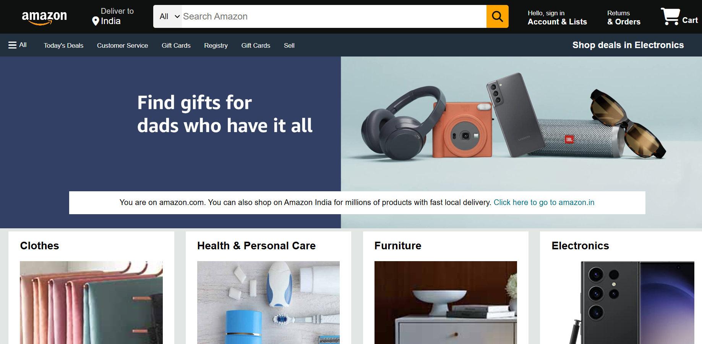

# Amazon-Clone-Project
# 🛒 Amazon Clone (HTML + CSS Only)

This is a **static clone of Amazon's homepage**, built using pure **HTML and CSS**, created as part of my web development learning journey. The layout closely resembles the real Amazon homepage, focusing on structure and design only.

---

## 📌 Features

- ✅ Amazon-style header and navigation bar  
- ✅ Search bar and category filter  
- ✅ Product showcase cards  
- ✅ Fully static layout (no JavaScript)  
- ✅ Footer similar to Amazon  
- ✅ Clean, responsive design

---

## 💻 Tech Stack

- **HTML5**
- **CSS3**

---

## 📁 Project Structure
amazon-clone/
├── index.html
├── style.css
├── Capture.PNG <-- Screenshot (for README)
└── images/ <-- Product/category images

---

## 🚀 How to Use

1. Clone or download the repository.
2. Open the `index.html` file directly in your browser.
3. No server setup or installation required.

---

## 🎯 Purpose of Project

> This project is part of my self-learning and practice.  
It helped me understand:
- HTML layout structure
- CSS styling and box models
- Real-world UI replication
- Clean design principles

---

## 📷 Preview

Below is a preview of the Amazon clone homepage created:

---

## 🙋‍♀️ Author

**Hina**  
📌 BCA 3rd Year Student | Aspiring Software Developer  
🔗 GitHub: [Hina7253]  
🔗 LinkedIn: [https://www.linkedin.com/in/hina-569635334]

---

## ⭐ Support

If you like this project:
- Give it a ⭐ on GitHub
- Share feedback
- Connect with me on LinkedIn

---

> ⚠️ **Disclaimer**: This project is created for educational purposes only and is not affiliated with Amazon in any way.

